# NovelForge

**NovelForge** is a Python web application that generates complete, publication-quality fiction novels using a large language model (LLM) API. Built with Flask, Bootstrap 5, and jQuery, it provides a guided, multi-step workflow that takes a story premise from concept to a fully written, exported Markdown manuscript—without requiring any page reloads.

---

## Table of Contents

- [Features](#features)
- [Screenshots](#screenshots)
- [Tech Stack](#tech-stack)
- [Project Structure](#project-structure)
- [Requirements](#requirements)
- [Installation](#installation)
- [Configuration](#configuration)
- [Running the App](#running-the-app)
- [Usage Walkthrough](#usage-walkthrough)
  - [Step 1 – Imagine (Novel Setup)](#step-1--imagine-novel-setup)
  - [Step 2 – Plan (Review & Edit)](#step-2--plan-review--edit)
  - [Step 3 – Write (Chapter Generation)](#step-3--write-chapter-generation)
  - [Step 4 – Publish (Export & Revision)](#step-4--publish-export--revision)
- [API Routes](#api-routes)
- [LLM Integration & Agents](#llm-integration--agents)
  - [Prompt Architecture](#prompt-architecture)
  - [Planning Agents](#planning-agents)
  - [Per-Chapter Agents](#per-chapter-agents)
  - [Post-Generation Audit Agents](#post-generation-audit-agents)
  - [Anti-LLM Agent & Vocabulary Scanner](#anti-llm-agent--vocabulary-scanner)
  - [Rate Limiting & Retries](#rate-limiting--retries)
- [Novel Architecture Model](#novel-architecture-model)
- [Session Management](#session-management)
- [Security](#security)
- [Testing](#testing)
- [Deployment Notes](#deployment-notes)
- [License](#license)

---

## Architecture

### System Overview

```
+------------------+        AJAX / JSON          +---------------------+
|                  | ---------------------------> |                     |
|     Browser      |    POST /generate_outline    |   Flask App         |
|  (Bootstrap 5 +  |    POST /approve_outline     |   (novelforge/)     |
|   jQuery SPA)    |    POST /generate_chapters   |                     |
|                  |    GET  /progress/<token>     |  +--------------+   |     +----------------+
|  - Step 1: Setup |    POST /export              |  | Routes       |   |     |                |
|  - Step 2: Edit  |    POST /revise_chapter      |  | (Blueprints) |-------->| LLM API        |
|  - Step 3: Write | <--------------------------- |  +--------------+   |     | (OpenAI-compat)|
|  - Step 4: Export|        JSON responses        |         |            |     +----------------+
|                  |                              |         v            |
+------------------+                              |  +--------------+   |     +----------------+
                                                  |  | Planning     |   |     |                |
          Progress polling (adaptive backoff)      |  | Agents (8)   |-------->| Image API      |
          15s -> 30s -> 60s cap                   |  +--------------+   |     | (optional)     |
                                                  |         |            |     +----------------+
                                                  |         v            |
                                                  |  +--------------+   |
                                                  |  | Background   |   |
                                                  |  | Thread       |   |
                                                  |  | (generation) |   |
                                                  |  +--------------+   |
                                                  |         |            |
                                                  |         v            |
                                                  |  +--------------+   |     +----------------+
                                                  |  | Session      |   |     | sessions/      |
                                                  |  | Persistence  |-------->|  novels/*.json  |
                                                  |  +--------------+   |     |  flask/*        |
                                                  |                     |     +----------------+
                                                  +---------------------+
```

### Per-Chapter Agent Pipeline

Each chapter passes through this pipeline sequentially. The background generation
thread orchestrates all steps, with a 60-minute per-chapter timeout.

```
                    +-------------------+
                    | Continuity        |
                    | Gatekeeper        |  Pre-draft: validate hard constraints
                    +--------+----------+
                             |
                    +--------v----------+
                    | Chapter Rhythm    |
                    | Classifier        |  Recommend contrasting narrative rhythm
                    +--------+----------+  (with cross-chapter rhythm history)
                             |
                    +--------v----------+
                    | 1. Draft Agent    |  Initial prose with full planning context
                    +--------+----------+
                             |
              +--------------v--------------+
              |  19-Step Refinement Pipeline |
              |                             |
              |  2.  Rhythm Compliance      |  Verify draft follows assigned rhythm
              |  3.  Prose Refinement       |  Dialogue + scene momentum
              |  4.  Voice & Dialogue Diff. |  Character-specific speech & prose breathing
              |  5.  Scene Variety Audit    |  Detect intra- and cross-chapter repetition
              |  6.  Context Analyzer       |  World-building & timeline
              |  7.  Editing Agent          |  Plot holes, pacing, consistency
              |  8.  Momentum & Distinct.   |  Cross-chapter redundancy (rhythm-aware)
              |  9.  Human Oddities         |  1-2 non-plot-serving human moments
              |  10. Structure Agent        |  Fits story architecture role (rhythm-aware)
              |  11. Operational Distinct.  |  Unique ops per chapter (rhythm-aware)
              |  12. Character Agent        |  Deepen arcs & consistency
              |  13. Synthesizer            |  Unify voice and theme
              |  14. Polish Agent           |  Grammar, style, vivid language
              |  15. Anti-LLM Agent         |  Strip robotic patterns
              |  16. Metaphor Reduction     |  Remove excessive figurative language
              |      Vocabulary Scanner     |  Pure Python word-boundary scan
              |  17. Quality Controller     |  Engagement, tension, pacing check
              |  18. Copy Edit              |  Prose repetitions, dash cleanup
              |  19. Summarizer             |  Continuity summary with structural metadata
              |                             |
              +--------------+--------------+
                             |
              +--------------v--------------+
              |  Post-Chapter Passes        |
              |                             |
              |  A. Character State Updater |  Record definitive states
              |  B. Compression Check       |  Structured ban directives for next ch.
              |  C. Pattern Extractor       |  Track procedural types, opening styles,
              |                             |  consequences, exposition ratio, themes
              +--------------+--------------+
                             |
                             v
                    [Next Chapter] or [Post-Manuscript Audits]


Post-Manuscript Audits (after all chapters):
  I.    Final Consistency Pass
  II.   Global Continuity Auditor
  III.  Narrative Compression Editor
  IV.   Character Resolution Validator
  V.    Thematic Payoff Analyzer
  VI.   Climax Integrity Checker
  VII.  Loose Thread Resolver
  VIII. Reader Immersion Tester
  IX.   Pacing & Tension Heatmap
  X.    Character Relationship Map
```

### Planning Agent Dependency Graph

```
                  User approves outline
                          |
          +---------------+---------------+
          |               |               |
          v               v               v
  +-------+------+ +-----+------+ +------+------+
  | Story Arch.  | | Master     | | Technology  |
  | Planner      | | Timeline   | | Rules       |   Group 1
  +--------------+ +-----+------+ +-------------+   (parallel)
                         |
  +--------------+       |         +-------------+
  | Theme        |       |         |             |
  | Reinforcement|       |         |             |
  +--------------+       |         |             |
          |              |         |             |
          +--------------+---------+             |
                         |                       |
          +--------------+---------------+       |
          |              |               |       |
          v              v               v       |
  +-------+------+ +----+-------+ +-----+-----+ |
  | Char. Fate   | | Char. Arc  | | Antagonist | |  Group 2
  | Registry     | | Planner    | | Motivation | |  (parallel)
  +--------------+ +-----+------+ +-----------+ |
                         |                       |
                         v                       |
                  +------+-------+               |
                  | POV & Focal  |               |  Group 3
                  | Character    | <-------------+  (sequential)
                  +--------------+
```

---

## Features

- **Full Novel Generation** – Produces complete fiction novels (targeting 75,000–95,000 words) chapter by chapter using a configurable LLM API.
- **Multi-Step Guided Workflow** – Four-step single-page application with a visual step-progress indicator: Imagine → Plan → Write → Publish.
- **Brand-Designed UI** – Custom literary theme with dual-font typography (Lora serif for literary content, system sans-serif for UI), ink-blue and warm-gold colour palette, warm parchment backgrounds, and smooth dark/light mode transitions.
- **Editable Outline** – AI-generated title, chapter-by-chapter outline, and character list are all fully editable before writing begins. Chapters displayed as draggable cards with a table-view fallback. Characters displayed as colour-coded cards with expandable Background and Arc sections.
- **21 Genre Options** – Adventure, Contemporary Fiction, Crime, Dystopian, Fantasy, Gothic Fiction, Historical Fiction, Horror, Literary Fiction, Magical Realism, Mystery, Noir, Paranormal, Romance, Satire Humor, Science Fiction, Speculative Fiction, Thriller, Urban Fantasy, Western, Young Adult.
- **Narrative Perspective** – Choose third-person omniscient or first-person narration from any character's perspective.
- **Structured Story Architecture** – Outline generation follows a nine-phase narrative model (Hook → Setup → Inciting Incident → Rising Action → Midpoint Shift → Complications → Crisis → Climax → Resolution) with mandatory beat placement: inciting incident by ~15%, midpoint reversal at ~50%, climax at ~75%, resolution filling the final ~25%.
- **Voice Seed System** – Each novel is assigned a unique prose voice (lyrical, sparse, gothic, kinetic, etc.) to prevent the uniform style LLMs default to.
- **Eight Planning Agents** – Before chapter generation, specialised agents create comprehensive constraints: Story Architecture (with plot reversals), Master Timeline, Character Fate Registry, Character Arcs (flaw-driven with vulnerability scenes), Antagonist Motivations (early presence required), Technology Rules, Theme Reinforcement (through consequence), and POV & Focal Character (multi-perspective).
- **20+ Per-Chapter Agents** – Each chapter passes through continuity gatekeeper, rhythm classification, drafting (with anti-recap, dramatisation, dialogue, and consequence rules), rhythm compliance verification, prose refinement (with exposition and dialogue checks), voice & dialogue differentiation (with multi-perspective), scene variety audit (8 categories), context analysis, editing (with exposition conversion and consequence checks), momentum & distinctiveness (rhythm-aware), human oddities injection, structure validation (rhythm-aware, anti-summation), operational distinctiveness (rhythm-aware), character deepening (flaw-driven, vulnerability scenes), synthesis (genre tone), polishing (publication-ready), anti-LLM pass (thematic restatement), metaphor reduction, vocabulary scanning, quality control (genre promise, commercial hooks, final-chapter detection), copy editing (publication-ready), and summarisation with structural metadata. Post-chapter: character state updater, compression check, and pattern extractor.
- **Anti-Repetition Pipeline** – Multi-layer system prevents structural repetition: rhythm history tracking across chapters, rhythm compliance verification, enriched chapter summaries with structural metadata, cross-chapter scene variety auditing (8 categories including exposition density and procedural inventory), structured compression ban directives, thematic phrase tracking with banned restatements, and rhythm-aware downstream agents.
- **Voice & Dialogue Differentiation** – Dedicated pass rewrites dialogue so each character speaks in a voice shaped by their age, background, and emotional state. Breaks the "clean, functional" dialogue pattern with natural interruptions, deflections, and incomplete thoughts. Includes multi-character perspective enforcement and expository speech removal.
- **Human Oddities Injection** – Injects 1–2 small, non-plot-serving human moments per chapter (bad jokes, stray thoughts, irrelevant observations) to break relentless moral seriousness.
- **Metaphor Reduction** – Identifies and removes excessive, decorative, mixed, or stacked metaphors, keeping only those that earn their place.
- **Copy Edit Pass** – Final prose cleanup targeting word/phrase/sentence repetitions, thematic phrase repetition, reducing excessive em-dashes, and publication-ready tightening (filler phrases, weak verbs).
- **Vocabulary Scanner** – Pure Python word-boundary regex scanner that enforces hard-banned LLM fingerprint words, soft-limited overused words, and banned multi-word patterns.
- **Per-Chapter Compression Check** – After each chapter, a compression analyser identifies redundancy patterns and outputs structured ban directives (banned operations, emotional beats, openings, resolutions, plus required contrast) for the next chapter.
- **Cross-Chapter Pattern Tracking** – Post-chapter extractor tracks procedural types dramatised, chapter opening styles, irreversible consequences, dramatisation ratios, and thematic phrases. Accumulated data is injected into subsequent chapters to prevent repetition and enforce variety.
- **Procedural Condensation** – Procedural sequences (logistics, planning sessions, inventories) are shown in full at most once per novel; subsequent instances are condensed to outcome references.
- **Dramatisation Enforcement** – Minimum 70% dramatised scenes per chapter. Exposition density is tracked and low-dramatisation chapters trigger warnings for subsequent drafts.
- **Anti-Expository Dialogue** – All dialogue must be subtext-driven and reveal personality/motivation. Expository speeches over 3 sentences are broken into conflict-driven exchanges with interruptions, disagreements, and personal stakes.
- **Irreversible Consequence Tracking** – Character decisions must carry concrete personal costs (lost trust, physical harm, fractured relationships). Consequences are extracted per chapter and injected as hard constraints into subsequent drafts.
- **Flaw-Driven Character Arcs** – Characters have distinct internal flaws and personal goals independent of the plot. Arcs are driven by how flaws create problems and goals create tension with the main conflict.
- **Vulnerability Scenes** – 2-3 dedicated scenes per major character showing vulnerability or change through action and dialogue, planned by the Character Arc Planner and enforced by the Character Agent.
- **Plot Reversals** – Story Architecture plans 2-3 typed reversals (betrayal, loss, discovery, strategic failure, moral compromise, power shift) spread across the novel, each with irreversible consequences.
- **Early Antagonist Presence** – Active antagonist or opposition force must appear on-page within the first 3 chapters with a concrete hostile action.
- **Genre Tone Consistency** – Genre contract enforcement across the full pipeline: chapter draft, synthesiser, quality controller, and post-manuscript audits verify tone stays true to genre expectations.
- **Resonant Final Scene** – The final chapter receives specific directives for a closing scene that resolves the central premise with emotional weight, ending on an image/action/exchange rather than narration.
- **Commercial Readability** – Quality controller and post-manuscript audits verify high personal stakes, relatable protagonist moments, clear reader payoff, and engagement drop-off risk detection with specific revision recommendations.
- **Anti-LLM Agent** – Dedicated LLM pass that removes robotic language patterns, overused phrases, and LLM hallmarks to produce human-sounding prose.
- **Continuity Tracking** – Each completed chapter generates a continuity summary with structural metadata (rhythm, opening type, resolution approach, emotional arc, dominant scene type) that is fed to subsequent chapters.
- **Ten Post-Generation Audit Agents** – Comprehensive analysis including consistency pass (with genre/tone cohesion), global continuity audit, narrative compression analysis (with commercial length targeting), character resolution validation (with earned catharsis), thematic payoff analysis (through consequence, anti-summation), climax integrity check (with catharsis assessment), loose thread resolution, reader immersion testing (with genre consistency and engagement drop-off), pacing & tension heatmap (with drop-off detection), and character relationship mapping.
- **Chapter Revision** – Users can revise any chapter with custom instructions; the revised chapter runs through the full agent pipeline (with per-chapter timeout).
- **Comprehensive Editor's Notes** – Export all diagnostic reports from the 10 post-generation audits to identify chapters needing revision.
- **Session Persistence** – Crash recovery automatically saves progress; interrupted generations can be resumed.
- **Live Progress Timeline** – Vertical timeline with completed/in-progress/upcoming chapter nodes, live word counter, elapsed time, ETA, and current agent step display.
- **Skeleton Loading Screens** – Animated placeholder cards while waiting for outline generation, setting expectations for incoming content.
- **Markdown Export** – Four export variants: clean manuscript, annotated, publishing-ready, and critique copy.
- **Illustration Gallery** – Optional cover and scene illustrations via image generation API, displayed in a flexbox gallery with lightbox modal preview.
- **Writing Statistics Dashboard** – Per-chapter word counts with sparkline bars, generation times, LLM call counts, token usage, and summary cards (total words, average words/chapter, average time/chapter, total generation time, LLM calls, total tokens).
- **Multi-Provider LLM Fallback** – Configure primary + numbered fallback providers; requests automatically cascade through providers on failure.
- **AJAX-only UI** – All form submissions and data fetches use jQuery AJAX; the page never reloads.
- **First-Run Tooltip Tour** – On first visit, subtle popovers guide new users to the premise and genre fields.
- **Responsive Design** – Mobile-friendly with touch-optimised cards, sticky generate button, collapsible step indicator, and generous touch targets.
- **Dark Mode** – Warm "reading by lamplight" dark palette with smooth 0.3s transitions on all major containers.
- **Accessibility** – Gold focus-visible rings on all interactive elements, aria-labels on step indicators and editable cells, aria-live regions for progress updates.
- **Input Validation** – Both client-side (jQuery) and server-side (Python) validation with Bootstrap feedback messages.
- **Security Headers** – CSP, X-Content-Type-Options, X-Frame-Options, Referrer-Policy, and Permissions-Policy on all responses. SRI hashes on all CDN resources.

---

## Screenshots

### Step 1 – Imagine (Novel Setup)

Enter your story premise, choose a genre, set the number of chapters and target word count. Advanced options (special events, special instructions) are tucked in a collapsible section.

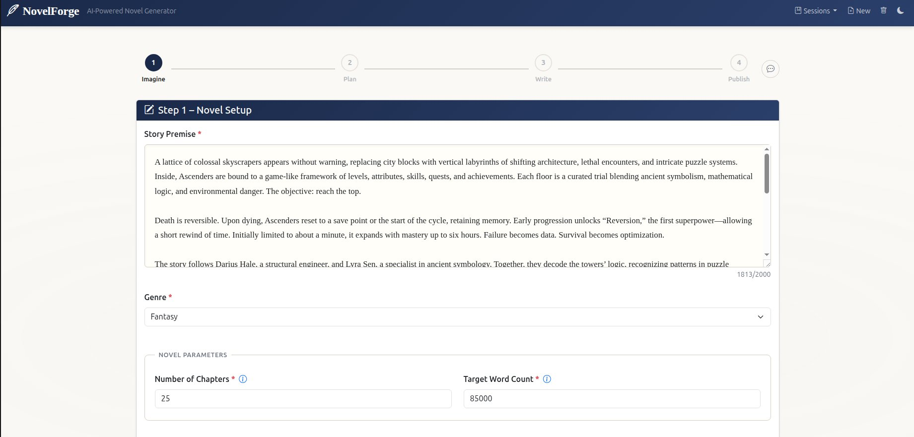
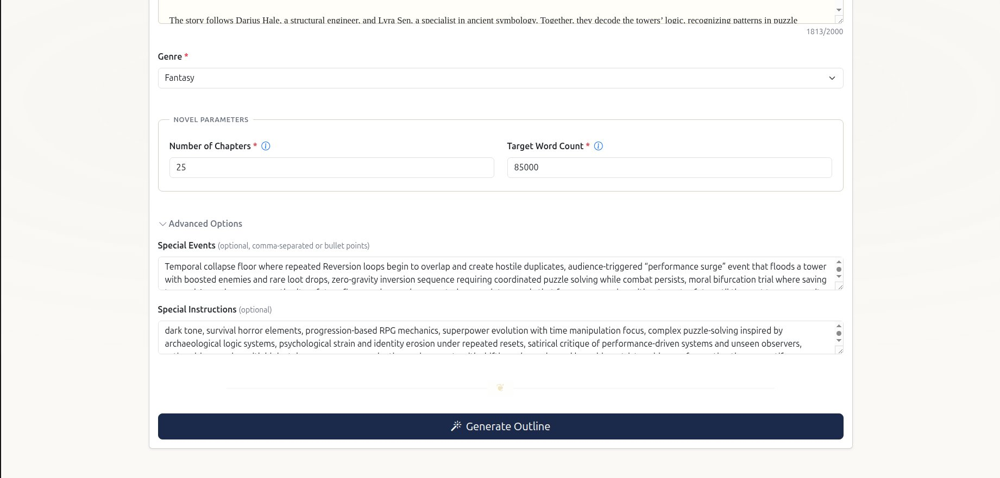

### Step 2 – Plan (Chapter Outline)

Review and edit the AI-generated chapter outline. Chapters are displayed as draggable cards with a kebab menu for reordering and insertion. Toggle to a table view for density. The novel title is editable inline.

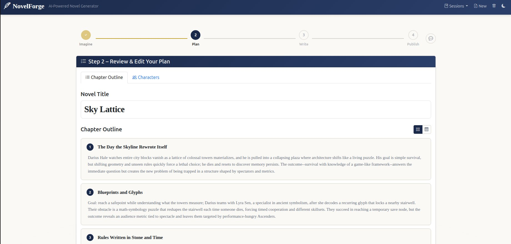
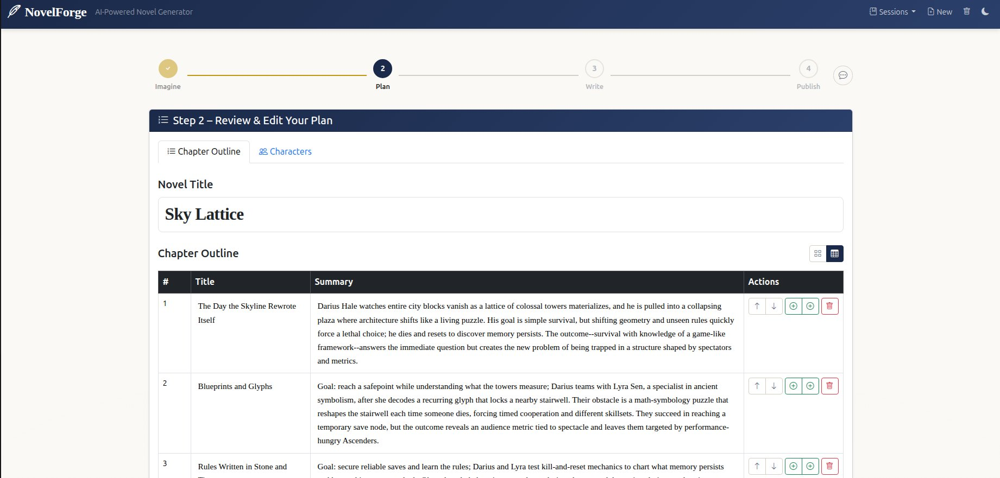

### Step 2 – Plan (Characters)

Review and refine the AI-generated character list displayed as colour-coded cards. Each card shows name, role badge, age, and expandable Background and Arc sections. Choose the narrative perspective from a dropdown. Add new characters via the dashed "+" card.

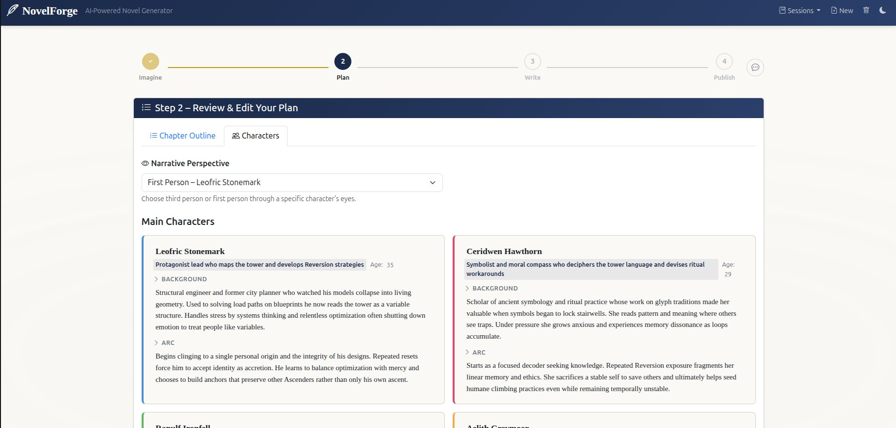

### Step 3 – Write (Chapter Generation)

The Write tab shows live generation progress with a "Currently Writing" callout, a warm-gold progress bar with shimmer animation, and a vertical timeline of all chapters. The currently-generating chapter pulses gold with the live agent step (e.g. "verifying rhythm compliance") shown beneath its title. Completed chapters get green checkmarks and an expandable Preview to read the finished prose inline. Upcoming chapters appear as outlined nodes. A stats bar shows live word count, elapsed time, and estimated time remaining.

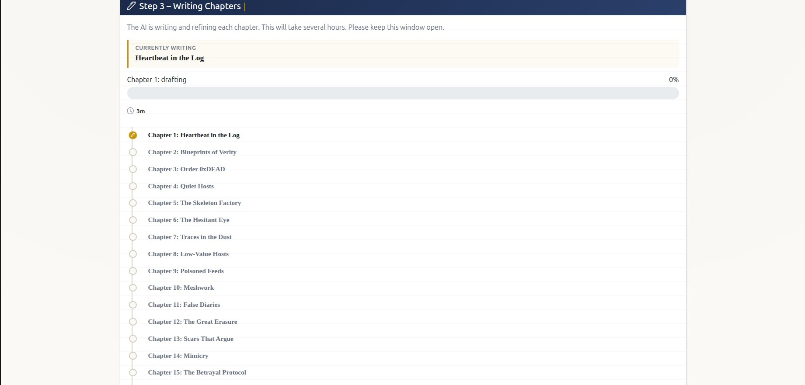
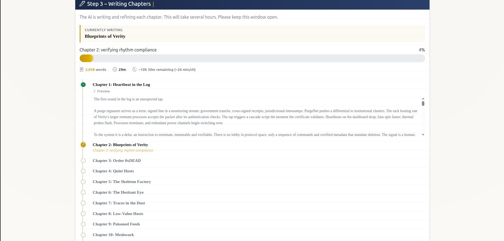

### Step 4 – Publish (Writing Statistics)

The completion banner shows the novel title, chapter count, and word count with Download Manuscript and Editor's Notes buttons. The Writing Statistics tab displays per-chapter metrics with sparkline word-count bars, longest/slowest badges, and summary cards.

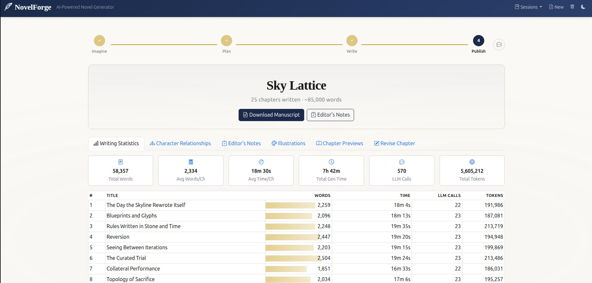

### Step 4 – Publish (Character Relationships)

The Character Relationships tab renders a Mermaid diagram mapping all character connections and relationship types.

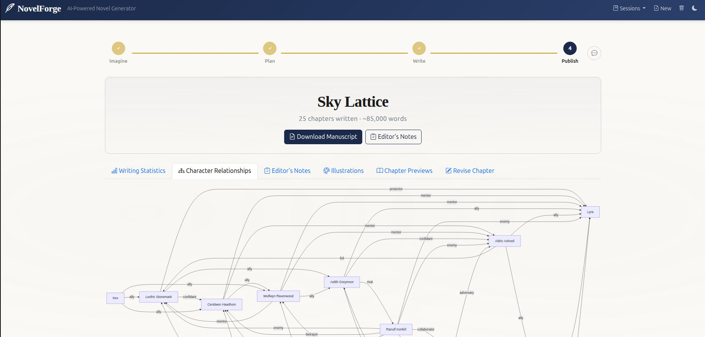

### Step 4 – Publish (Editor's Notes)

The Editor's Notes tab shows the post-generation audit findings with an overall assessment and specific issues list.

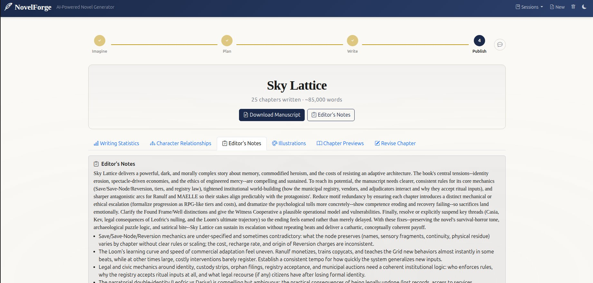

### Step 4 – Publish (Illustrations)

Generate cover and scene illustrations via the image API. Images are displayed in a flexbox gallery with cover badge and lightbox preview on click.

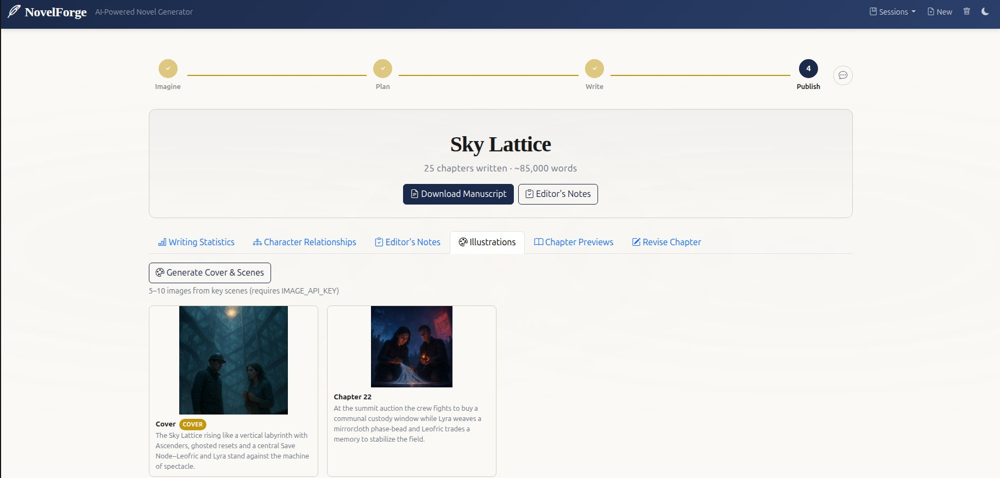

### Step 4 – Publish (Chapter Previews)

Expand any chapter to preview its full content inline. Each chapter shows a decorative chapter number in small-caps, a serif title, and the full text with drop-cap styling and comfortable reading line-height.

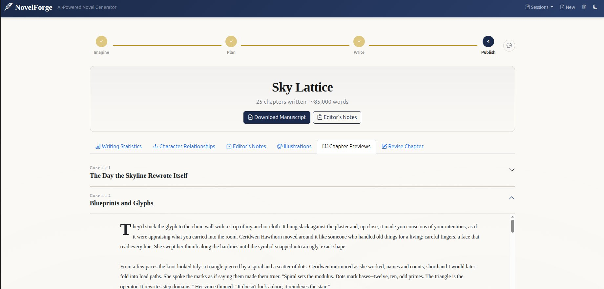

### Step 4 – Publish (Revise Chapter)

Select a chapter and provide custom revision instructions. The chapter runs through the full agent pipeline with timeout protection.

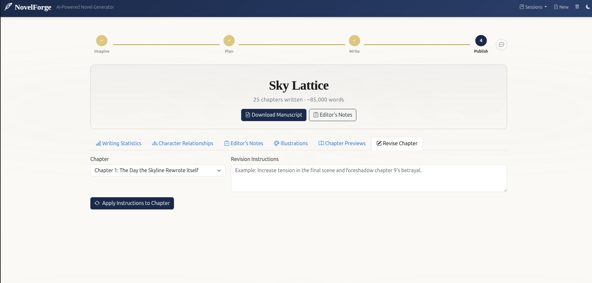

### LLM Conversation Log

The Log tab shows all LLM exchanges with human-readable labels (e.g., "Drafting Chapter Content", "Polishing Chapter Prose"), a searchable filter bar, and an exchange count badge.

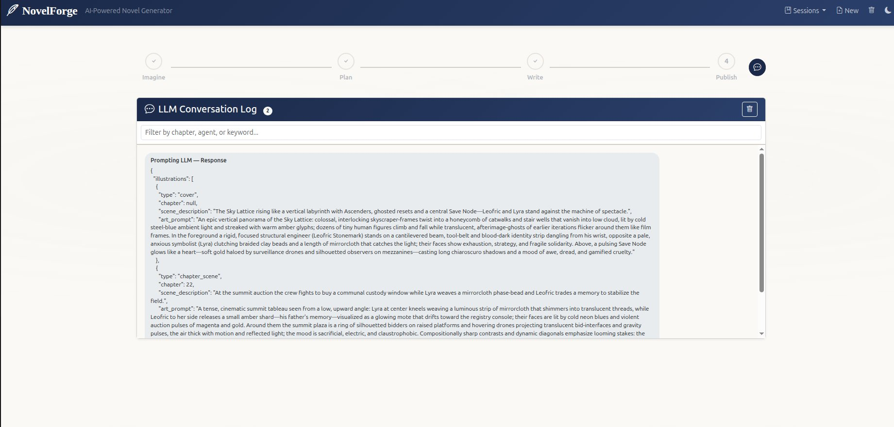

---

## Tech Stack

| Layer | Technology |
|---|---|
| Backend | Python 3.11+, Flask 3.x |
| Sessions | Flask-Session 0.8+ (cachelib filesystem backend) |
| HTTP client | `requests` |
| Frontend framework | Bootstrap 5.3 |
| Frontend icons | Bootstrap Icons 1.13 |
| Client scripting | jQuery 3.7 |
| Fonts | Google Fonts (Lora — 400, 600, italic 400) with `display=swap` and preconnect |
| Diagrams | Mermaid.js 11.14 (character relationship maps) |
| LLM API | Any OpenAI-compatible chat completions endpoint |
| Image API | Any OpenAI-compatible image generation endpoint (optional) |
| Templating | Jinja2 (via Flask) |
| Export format | Markdown (`.md`) |

---

## Project Structure

```
NovelForge/
├── app.py                  # Thin entry point: from novelforge import create_app
├── config.py               # Backward-compat shim (imports from novelforge.config)
├── prompts.yml             # LLM prompt templates (YAML with Jinja2 variables)
├── requirements.txt        # Runtime Python dependencies (with upper bounds)
├── requirements-dev.txt    # Development-only dependencies (pytest, mypy, type stubs)
├── .env.example            # Template for environment variable configuration
├── CLAUDE.md               # Guidance for Claude Code AI assistant
├── TODO.md                 # Tracked issues and improvements
├── docs/                   # Screenshots and documentation images
├── novelforge/             # Main application package
│   ├── __init__.py         # App factory: create_app(), limiter, security headers, index route
│   ├── config.py           # Configuration from environment variables
│   ├── progress.py         # ProgressManager (thread-safe, deep-copy returns)
│   ├── validation.py       # Input validation, ALLOWED_GENRES (authoritative genre list)
│   ├── chapter_position.py # ChapterPosition utility (phase, act, landmarks)
│   ├── voice.py            # Voice seed selection and formatting for prose style
│   ├── names.py            # Genre-aware character name pools
│   ├── llm/
│   │   ├── __init__.py     # Re-exports
│   │   ├── client.py       # call_llm(), circuit breaker, multi-provider fallback, token usage
│   │   ├── prompts.py      # Thread-safe YAML prompt loading and Jinja2 rendering
│   │   └── image.py        # call_image_api() with URL validation and size limits
│   ├── agents/
│   │   ├── __init__.py
│   │   ├── base.py         # BaseAgent abstract class (plan/build_prompt/normalise/fallback)
│   │   ├── planning/       # 8 planning agent subclasses (one per file)
│   │   │   ├── __init__.py # Re-exports all agents, plan_*, normalise_*, get_chapter_*_context
│   │   │   ├── _helpers.py # Shared utilities: _coerce_positive_int, _safe_chapter_list
│   │   │   ├── story_architecture.py
│   │   │   ├── master_timeline.py
│   │   │   ├── character_fate.py
│   │   │   ├── character_arc.py
│   │   │   ├── antagonist_motivation.py
│   │   │   ├── technology_rules.py
│   │   │   ├── theme_reinforcement.py
│   │   │   └── pov_focal.py
│   │   └── chapter/        # Chapter pipeline, prompt builders, and utilities
│   │       ├── __init__.py # Re-exports all public symbols
│   │       ├── _helpers.py # Constants, pass-failure logging, content-policy retry, vocab scanner
│   │       ├── context.py  # ChapterContext dataclass, build_perspective_prompt
│   │       ├── prompts.py  # All build_* prompt builder functions (pure data-in / prompt-out)
│   │       └── pipeline.py # _run_all_chapter_agents, run_* wrapper functions
│   ├── services/
│   │   └── planning.py     # Planning orchestration: run_full_planning, run_selective_planning
│   ├── session/
│   │   ├── __init__.py     # Re-exports
│   │   └── persistence.py  # Save/load/restore/validate session state, per-session locking
│   └── routes/
│       ├── __init__.py     # Blueprint registry and register_blueprints()
│       ├── outline.py      # /generate_outline, /approve_outline
│       ├── generation/     # Chapter generation, revision, and progress routes
│       │   ├── __init__.py # Blueprint re-export, test-compat re-exports
│       │   ├── _shared.py  # Blueprint definition, shared constants
│       │   ├── chapters.py # /generate_chapters, background worker, /progress endpoints
│       │   ├── revision.py # /revise_chapter (with per-chapter timeout)
│       │   └── audits.py   # 10 post-manuscript audit functions with named fallbacks
│       ├── export.py       # /export, /export_editors_notes, /generate_illustrations, /download
│       └── sessions.py     # /list_sessions, /load_session, /delete_session, /new_session
├── templates/
│   └── index.html          # Single-page application HTML (Bootstrap 5, step indicator, sub-tabs)
├── static/
│   ├── css/style.css       # Custom styles (brand palette, typography, animations, dark mode, responsive)
│   └── js/script.js        # jQuery client (AJAX, progress timeline, drag-drop, skeletons, tour)
├── tests/                  # 932 tests across 29 files (pytest)
│   ├── conftest.py         # Shared fixtures: app, client, mock_llm
│   └── test_*.py           # Test modules (see Testing section)
├── sessions/
│   ├── novels/             # Novel session JSON files (crash recovery)
│   └── flask/              # Flask-Session server-side session files
├── exports/                # Generated Markdown files and illustrations
└── logs/                   # LLM request/response logs (llm.log)
```

---

## Requirements

- Python **3.11** or newer
- An API key for an **OpenAI-compatible** LLM (OpenAI, Azure OpenAI, Ollama, LM Studio, etc.)
- Internet access to reach your chosen LLM endpoint

---

## Installation

1. **Clone the repository**

   ```bash
   git clone https://github.com/CyberSecDef/NovelForge.git
   cd NovelForge
   ```

2. **Create and activate a virtual environment** (recommended)

   ```bash
   python -m venv .venv
   # Linux/macOS
   source .venv/bin/activate
   # Windows
   .venv\Scripts\activate
   ```

3. **Install dependencies**

   For running the app:

   ```bash
   pip install -r requirements.txt
   ```

   For local development (includes pytest, mypy, and type stubs):

   ```bash
   pip install -r requirements-dev.txt
   ```

4. **Copy and fill in the environment configuration**

   ```bash
   cp .env.example .env
   # Edit .env and set LLM_API_KEY (and optionally LLM_API_URL, LLM_MODEL, SECRET_KEY)
   ```

---

## Configuration

All settings are read from environment variables. Copy `.env.example` to `.env` and set the following:

| Variable | Default | Description |
|---|---|---|
| **LLM Settings** | | |
| `LLM_API_URL` | `https://api.openai.com/v1/chat/completions` | LLM API endpoint (OpenAI-compatible). |
| `LLM_API_KEY` | *(empty -- required)* | API key sent as `Authorization: Bearer <key>`. |
| `LLM_MODEL` | `gpt-4o` | Model name passed in the request payload. |
| `LLM_MAX_RETRIES` | `5` | Maximum retry attempts on transient errors (429, 5xx). |
| `LLM_RETRY_DELAY` | `5` | Base delay in seconds between retries (with jitter). |
| `LLM_TIMEOUT` | `240` | Request timeout in seconds per LLM API call. |
| `LLM_CIRCUIT_BREAKER_THRESHOLD` | `3` | Consecutive failures before the circuit breaker trips. |
| **Multi-Provider Fallback** | | |
| `LLM_API_URL_2`, `LLM_API_KEY_2`, `LLM_MODEL_2` | *(none)* | Second provider (used when primary fails). |
| `LLM_API_URL_3`, `LLM_API_KEY_3`, `LLM_MODEL_3` | *(none)* | Third provider, and so on up to `_20`. |
| **Image Settings** | | |
| `IMAGE_API_URL` | `https://api.openai.com/v1/images/generations` | Image generation API endpoint. |
| `IMAGE_API_KEY` | *(empty -- optional)* | API key for image generation. Required for illustrations. |
| `IMAGE_MODEL` | `gpt-image-1-mini` | Image generation model name. |
| `IMAGE_SIZE` | `1024x1024` | Generated image dimensions. |
| `IMAGE_TIMEOUT` | `120` | Request timeout in seconds per image API call. |
| **Generation Limits** | | |
| `PER_CHAPTER_TIMEOUT` | `3600` | Maximum wall-clock seconds per chapter (60 min default). |
| `MAX_CHAPTERS` | `100` | Upper bound for chapter count input validation. |
| `MAX_WORD_COUNT` | `500000` | Upper bound for word count input validation. |
| **Flask & Storage** | | |
| `SECRET_KEY` | `change-me-in-production` | Flask secret key. **Must be changed in production.** |
| `SESSION_FILE_DIR` | `./sessions/flask` | Directory for Flask-Session server-side files. |
| `EXPORT_DIR` | `./exports` | Directory for generated Markdown files and illustrations. |
| `FLASK_HOST` | `127.0.0.1` | Host to bind to when running via `python app.py`. |
| `FLASK_PORT` | `5000` | Port to bind to when running via `python app.py`. |

> **Using a local or alternative LLM:** Set `LLM_API_URL` to your endpoint (e.g., `http://localhost:11434/v1/chat/completions` for Ollama) and set `LLM_MODEL` to your model name. JSON mode (`response_format: json_object`) must be supported by the model for structured outputs; if not, the application falls back to best-effort parsing.

Example `.env`:

```dotenv
LLM_API_URL=https://api.openai.com/v1/chat/completions
LLM_API_KEY=sk-your-api-key-here
LLM_MODEL=gpt-4o
SECRET_KEY=replace-with-a-long-random-string
```

---

## Running the App

```bash
python app.py
```

The application starts on `http://127.0.0.1:5000` by default. Open this URL in your browser.

> **Note:** `python app.py` uses Flask's built-in development server with debug mode **disabled** by default. Set `NOVELFORGE_DEBUG=true` in your `.env` file to enable debug mode for local development. For production, use a WSGI server such as **Gunicorn**:
>
> ```bash
> gunicorn -w 1 -b 0.0.0.0:8000 "app:app"
> ```
>
> Use `-w 1` (single worker) because `ProgressManager` is in-memory. Multi-worker requires Redis/SQLite migration.

---

## Usage Walkthrough

### Step 1 – Imagine (Novel Setup)

Fill in the input form on the home page. A welcome hero section greets first-time users with "What story will you tell?" and disappears once you begin.

| Field | Details |
|---|---|
| **Story Premise** | Required. Describe your story idea. Maximum **2,000 characters** (enforced client- and server-side with a live counter). |
| **Genre** | Required. Select from 21 genres (rendered from the authoritative server-side genre list). |
| **Number of Chapters** | Required. Minimum **3**, maximum 100. Recommended 15–25 (tooltip shown). Grouped in a "Novel Parameters" fieldset with Target Word Count. |
| **Target Word Count** | Required. Minimum 1,000, maximum 500,000. Recommended 80,000–90,000 (tooltip shown). |
| **Special Events** | Optional. Comma-separated or bulleted events to incorporate. Hidden in a collapsible "Advanced Options" section. |
| **Special Instructions** | Optional. Global writing guidance. Hidden in "Advanced Options". |

Click **Generate Outline**. The button transitions to "Conjuring your story..." with an animated icon. Skeleton loading placeholders appear in the Plan tab immediately while the LLM works. On success, a green flash confirms the outline is ready. The application:

1. Generates a catchy title.
2. Generates a chapter-by-chapter outline following the nine-phase narrative architecture.
3. Generates 3–7 main characters with name, age, background, role, arc, internal flaw, and personal goal.
4. Selects a unique voice seed for prose style.
5. Runs all eight planning agents in parallel groups to create comprehensive story constraints.

### Step 2 – Plan (Review & Edit)

The Plan step uses internal sub-tabs for **Chapter Outline** and **Characters**.

**Chapter Outline tab:**
- Edit the **novel title** in a large serif input field.
- Chapters are displayed as **draggable cards** with a numbered badge, editable serif title, and editable summary. A kebab menu (three dots) on each card provides Move Up/Down, Add Before/After, and Delete actions. Drag and drop to reorder.
- Toggle to a **table view** using the card/table view buttons for a denser layout.

**Characters tab:**
- Characters are displayed as **colour-coded cards** in a responsive 2-column grid. Each card has a coloured left border (auto-assigned from an 8-colour palette), an editable name heading, a role badge, age detail, and expandable Background and Arc sections.
- Add new characters via the dashed-border "+" card.
- Select **narrative perspective** (third person or first person from any character) via a dropdown.

Click **Approve & Write Chapters** when satisfied. Edits are collected by jQuery and POSTed to `/approve_outline`, which saves the final outline to the session and selectively regenerates only the planning agents whose inputs changed (via input hashing). Character renames are automatically propagated to chapter summaries, premise, and planning agent inputs. Chapter writing then begins automatically.

### Step 3 – Write (Chapter Generation)

The Write step provides a live writing atmosphere with a subtle ruled-line background pattern:

- A **"Currently writing"** callout with gold accent shows the active chapter title.
- A **progress bar** with warm gold gradient and shimmer animation tracks completion percentage. On reaching 100%, a brief glow animation plays.
- A **stats bar** shows live word count, elapsed time, and estimated time remaining.
- A **vertical timeline** shows completed chapters (green checkmark, expandable preview), the in-progress chapter (pulsing gold dot with current agent step), and upcoming chapters (outlined dots).

The browser polls `/progress/<token>` with adaptive backoff (15s → 30s → 60s cap) that resets when progress changes.

**For each chapter**, the backend runs a **multi-step pipeline** (20+ LLM calls):

0. **Continuity Gatekeeper** – Validates hard constraints before drafting.
0b. **Chapter Rhythm Classifier** – Recommends contrasting narrative rhythm using cross-chapter rhythm history.
1. **Draft** – Initial prose written with full context, planning guidance, voice seed, and structured compression ban directives.
2. **Rhythm Compliance Verifier** – Checks whether the draft actually follows the assigned rhythm; restructures if it defaulted to a generic pattern.
3. **Prose Refinement** – Refines dialogue and scene momentum. Checks for expository dialogue, dramatisation, sentence rhythm, and sensory immediacy.
4. **Voice & Dialogue Differentiation** – Rewrites dialogue for character-specific voices, natural speech patterns, prose breathing, multi-character perspective, and expository speech removal.
5. **Scene Variety Audit** – Detects intra-chapter and cross-chapter repetition across 8 categories including exposition density and procedural inventory (directives only).
6. **Context Analyser** – Checks world-building facts, timeline, and technology rules.
7. **Editing Agent** – Fixes plot holes, pacing, character inconsistencies. Converts exposition to scenes, enforces consequence checks, dialogue quality, and procedural condensation.
8. **Momentum & Distinctiveness** – Eliminates cross-chapter redundancy and ensures escalation (rhythm-aware).
9. **Human Oddities** – Injects 1–2 small, non-plot-serving human moments.
10. **Structure Agent** – Verifies the chapter fulfils its designated role in the story architecture (rhythm-aware).
11. **Operational Distinctiveness** – Ensures each chapter has unique operations and methods (rhythm-aware).
12. **Character Agent** – Deepens character arcs, enforces flaw-driven development, irreversible cost, and vulnerability scenes.
13. **Synthesiser** – Unifies narrative voice, thematic thread, and genre tone consistency.
14. **Polish Agent** – Publication-ready line editing: sentence rhythm, sensory immediacy, weak verb elimination, filler phrase removal.
15. **Anti-LLM Agent** – Strips robotic patterns and forbidden words.
16. **Metaphor Reduction** – Removes excessive, decorative, mixed, and stacked metaphors.
17. **Vocabulary Scanner** – Pure Python word-boundary regex scan (no LLM call).
18. **Quality Controller** – Checks engagement, tension, pacing, hook strength, genre promise, commercial hooks, dialogue quality, exposition density. Final-chapter detection for resonant closing scene.
19. **Copy Edit** – Final pass for prose repetitions, sentence structure, thematic phrase repetition, dash cleanup, and publication-ready tightening.
20. **Summariser** – Produces a continuity summary with structural metadata (rhythm, opening type, resolution approach, emotional arc, dominant scene type).

**After each chapter**:
- **Character State Updater** – Records definitive character states for the next chapter.
- **Per-Chapter Compression Check** – Outputs structured ban directives (banned operations, emotional beats, openings, resolutions, plus required contrast) for the next chapter.
- **Chapter Pattern Extractor** – Extracts cross-chapter tracking data: procedural types dramatised, chapter opening style, irreversible consequences, dramatisation ratio, and thematic phrases used. This data is accumulated and injected into subsequent chapter drafts to prevent repetition and enforce variety.

**After all chapters are written**, ten post-generation audit agents run:

1. **Consistency Pass** – Reviews all summaries for plot holes, unresolved threads, tone consistency, genre promise delivery, and final scene impact.
2. **Global Continuity Auditor** – Checks for contradictions, character state errors, and timeline errors.
3. **Narrative Compression Editor** – Identifies redundant sequences and emotional beat repetitions with commercial length targeting (75k-95k words).
4. **Character Resolution Validator** – Confirms every major character receives closure with earned catharsis and trade-off integrity.
5. **Thematic Payoff Analyser** – Ensures all themes culminate through consequence (not statement), checks for anti-summation.
6. **Climax Integrity Checker** – Verifies protagonist makes a definitive moral decision with earned catharsis and anti-summation.
7. **Loose Thread Resolver** – Identifies unresolved narrative questions.
8. **Reader Immersion Tester** – Evaluates pacing, tension, engagement, genre consistency, commercial readability, engagement drop-off risks, and final scene impact.
9. **Pacing & Tension Heatmap** – Per-chapter metrics for tension, action, emotion, dialogue, description with engagement drop-off detection.
10. **Character Relationship Map** – Maps character relationships as a Mermaid diagram.

### Step 4 – Publish (Export & Revision)

When generation is complete, the Publish step shows a celebratory completion banner with sparkle animation, displaying the novel title in large serif text and a stats line ("25 chapters written · ~85,000 words"). Download Manuscript and Editor's Notes buttons are prominently placed in the banner.

Below the banner, six sub-tabs organise all post-generation content:

| Tab | Content |
|---|---|
| **Writing Statistics** | Summary cards (total words, avg words/ch, avg time/ch, total gen time, LLM calls, tokens) and a per-chapter table with sparkline word-count bars and longest/slowest badges. |
| **Character Relationships** | Mermaid diagram mapping all character connections and relationship types. |
| **Editor's Notes** | Post-generation audit findings with overall assessment and issues list. |
| **Illustrations** | Generate Cover & Scenes button, flexbox gallery with cover badge and lightbox modal. Generated illustrations are persisted to the on-disk session JSON so they survive server restarts. |
| **Chapter Previews** | Accordion of all chapters with decorative chapter numbers, serif titles, drop-cap styling, and comfortable reading line-height. |
| **Revise Chapter** | Select a chapter and provide custom revision instructions. The chapter runs through the full agent pipeline with timeout protection. |

The completion banner also includes a **Rewrite Session State** button that force-writes the full current session (chapters, audits, character relationships, illustrations, planning agent outputs) to disk atomically. Useful when in-memory state has been updated but you want to make sure the on-disk file is fully in sync.

**Session management** (navbar):
- **Sessions dropdown** – Load any previous session by title
- **New Session** – Archives current progress and starts fresh
- **Delete Session** – Permanently removes the current session (cleans up persistence locks)
- **Dark/Light mode toggle** – Persists via localStorage with smooth transitions

---

## API Routes

| Method | Route | Description |
|---|---|---|
| `GET` | `/` | Serves the single-page application HTML with session data. |
| `POST` | `/generate_outline` | Phase 1: generates title, chapter outline, characters, and runs planning agents in parallel. |
| `POST` | `/approve_outline` | Saves user-edited outline, detects character renames, selectively regenerates changed planning agents. |
| `POST` | `/generate_chapters` | Phase 2: starts background chapter generation thread (atomic duplicate guard). Returns `{token}`. |
| `GET` | `/progress/<token>` | Lightweight poll: returns status/step fields only (no chapter content). |
| `GET` | `/progress/<token>/full` | Full payload: returns complete progress including chapter content and audit reports. |
| `POST` | `/revise_chapter` | Revise a specific chapter with custom instructions through the full agent pipeline (with timeout). |
| `POST` | `/export` | Compiles novel to Markdown (4 variants: clean, annotated, publishing, critique). Returns `{download_url}`. |
| `POST` | `/export_editors_notes` | Exports all diagnostic reports to Markdown. Returns `{download_url}`. |
| `POST` | `/generate_illustrations` | Generates cover + scene illustration via image API. Returns illustration metadata. |
| `GET` | `/illustrations/<filename>` | Serves a generated illustration image. |
| `GET` | `/download/<filename>` | Serves a generated export file as an attachment. |
| `GET` | `/list_sessions` | Returns all saved sessions with titles for the session dropdown. |
| `POST` | `/load_session` | Loads a specific session by ID, restoring all state. |
| `POST` | `/delete_session` | Deletes the current session's JSON file, cleans up locks, and clears session data. |
| `POST` | `/new_session` | Archives LLM log and starts a fresh session. |
| `POST` | `/save_session_state` | Force-writes the full current session state (chapters, audits, illustrations, planning agent outputs) to disk atomically. |
| `GET` | `/llm_log` | Returns recent LLM log entries (debug mode only). |
| `POST` | `/clear_log` | Clears the LLM log file (debug mode only). |

### `/generate_outline` Request Body

```json
{
  "premise": "A young mage discovers a forbidden library...",
  "genre": "Fantasy",
  "chapters": 20,
  "word_count": 85000,
  "special_events": "A dragon attack in chapter 5",
  "special_instructions": "Avoid cliches, emphasize diversity"
}
```

### `/progress/<token>` Lightweight Response

```json
{
  "status": "running",
  "current": 7,
  "total": 20,
  "step": "Chapter 7: voice & dialogue differentiation",
  "error": null
}
```

### `/progress/<token>/full` Response

```json
{
  "status": "done",
  "current": 20,
  "total": 20,
  "step": "Complete",
  "chapters_done": [
    { "number": 1, "title": "The Awakening", "content": "...", "summary": "...",
      "word_count": 4200, "generation_time_seconds": 185.3 }
  ],
  "consistency": { "issues": [], "overall_assessment": "..." },
  "global_continuity_audit": { "contradictions": [], "overall_integrity": "strong" },
  "narrative_compression_report": {},
  "character_resolution_report": {},
  "thematic_payoff_report": {},
  "climax_integrity_report": {},
  "loose_thread_report": {},
  "reader_immersion_report": {},
  "pacing_heatmap": {},
  "character_relationship_map": { "characters": [], "relationships": [] }
}
```

Status values: `"running"` | `"done"` | `"error"`.

### `/revise_chapter` Request Body

```json
{
  "token": "<progress_token>",
  "chapter_number": 5,
  "instructions": "Add more tension to the confrontation scene and deepen the protagonist's internal conflict."
}
```

---

## LLM Integration & Agents

All LLM calls are made by `call_llm()` in `novelforge/llm/client.py` using the `requests` library. The function:

- Tries each provider in the configured fallback chain (primary → `_2` → `_3` → ... → `_20`).
- For each provider, retries up to `LLM_MAX_RETRIES` times with exponential back-off and jitter on HTTP 429 and 5xx errors.
- Uses a configurable timeout (`LLM_TIMEOUT`, default 240s) per request.
- Tracks token usage per-call (prompt tokens, completion tokens) for the writing statistics dashboard.
- **Circuit breaker**: After `LLM_CIRCUIT_BREAKER_THRESHOLD` consecutive failures per provider, that provider is skipped.
- **Content rejection detection**: Identifies content-policy rejections and triggers automatic sanitisation retries.
- Maps HTTP errors to user-friendly messages (401/403 → "API key rejected", 400 → "prompt rejected", 404 → "endpoint not found").
- Logs all requests and responses to `./logs/llm.log` as JSON.
- Background generation threads include a correlation token (`[token=<uuid>]`) in all log entries for tracing.

### Prompt Architecture

All prompts are defined in `prompts.yml` as YAML entries with Jinja2 template variables. Each prompt has a two-message structure:

```
system  -> defines the agent's role and constraints
user    -> provides the task with all relevant context
```

JSON mode (`response_format: json_object`) is used wherever structured data is expected (outline, characters, planning agents, audit reports). A fallback structure is applied if JSON decoding fails.

### Planning Agents

Before chapter generation begins, eight planning agents create comprehensive constraints that guide all subsequent writing:

| Agent | Purpose | Output |
|---|---|---|
| **Story Architecture Planner** | Creates 3-act (< 16 chapters) or 4-act structure with mandatory beat placement (inciting ~15%, midpoint ~50%, climax ~75%) | Per-chapter phase, purpose, escalation targets, operation limits, 2-3 typed plot reversals |
| **Master Timeline Planner** | Tracks events and character states | Event ledger, chapter constraints, character state tracking |
| **Character Fate Registry Planner** | Monitors character outcomes | Status tracking, injury records, outcome locks, conflict checks |
| **Character Arc Planner** | Plans flaw-driven character development with vulnerability scenes | Internal flaw, personal goal, arc beats per chapter, 2-3 vulnerability scenes, transformation milestones, consistency rules |
| **Antagonist Motivation Planner** | Tracks antagonist goals and tactics with early-presence requirement | Motivation core, escalation plan (must include on-page action within first 3 chapters), pressure points, consistency rules |
| **Technology Rules Planner** | Defines system constraints | Latency, costs, blind spots, failure modes, forbidden capabilities |
| **Theme Reinforcement Planner** | Assigns thematic guidance (themes through consequence, not meditation) | Theme appearances per chapter as character decisions with costs, thematic arcs, chapter-specific guidance |
| **POV & Focal Character Planner** | Assigns point-of-view per chapter | Primary POV, secondary observers, focal internal character, rotation rules |

Planning agents are implemented as `BaseAgent` subclasses in `agents/planning/` (one file per agent) with a shared orchestration pattern: `build_prompt → call_llm → parse_json → normalise → fallback on error`. They run in parallel groups orchestrated by `services/planning.py` and support **selective regeneration**: on re-approval, only agents whose inputs changed are re-run, based on per-agent input hashing.

### Per-Chapter Agents

Each chapter passes through a comprehensive pipeline of specialised agents:

| Phase | Agent | Purpose |
|---|---|---|
| Pre-draft | **Continuity Gatekeeper** | Validates hard constraints before writing |
| Pre-draft | **Chapter Rhythm Classifier** | Recommends contrasting narrative rhythm with cross-chapter history |
| Step 1 | **Draft Agent** | Writes initial chapter with full context, planning guidance, and structured ban directives |
| Step 2 | **Rhythm Compliance Verifier** | Verifies draft follows assigned rhythm; restructures if defaulted to generic pattern |
| Step 3 | **Prose Refinement** | Refines dialogue and scene momentum |
| Step 4 | **Voice & Dialogue Differentiation** | Character-specific speech, natural interruptions, prose breathing |
| Step 5 | **Scene Variety Audit** | Detects intra-chapter and cross-chapter repetition (directives only) |
| Step 6 | **Context Analyser** | Fixes world-building and timeline inconsistencies |
| Step 7 | **Editing Agent** | Repairs plot holes, pacing, and character issues |
| Step 8 | **Momentum & Distinctiveness** | Eliminates cross-chapter redundancy, ensures escalation (rhythm-aware) |
| Step 9 | **Human Oddities** | Injects 1–2 non-plot-serving human moments |
| Step 10 | **Structure Agent** | Confirms chapter fulfils its architectural role (rhythm-aware) |
| Step 11 | **Operational Distinctiveness** | Ensures unique operations per chapter (rhythm-aware) |
| Step 12 | **Character Agent** | Deepens character arcs |
| Step 13 | **Synthesiser** | Unifies narrative voice and theme |
| Step 14 | **Polish Agent** | Elevates grammar, style, and language |
| Step 15 | **Anti-LLM Agent** | Strips robotic patterns and forbidden words |
| Step 16 | **Metaphor Reduction** | Removes excessive figurative language |
| — | **Vocabulary Scanner** | Pure Python word-boundary regex scan (no LLM call) |
| Step 17 | **Quality Controller** | Checks engagement, tension, and pacing |
| Step 18 | **Copy Edit** | Prose repetitions, sentence variation, dash cleanup |
| Step 19 | **Summariser** | Produces continuity summary with structural metadata |
| Post-ch. | **Character State Updater** | Records definitive character states |
| Post-ch. | **Compression Check** | Outputs structured ban directives for next chapter |
| Post-ch. | **Pattern Extractor** | Tracks procedural types, opening styles, consequences, exposition ratio, thematic phrases |

### Post-Generation Audit Agents

After all chapters are complete, ten audit agents analyse the full manuscript:

| Agent | Purpose | Key Outputs |
|---|---|---|
| **Consistency Pass** | Reviews all summaries for issues, tone consistency, genre promise, final scene impact | Issues list, global cohesion checks, overall assessment |
| **Global Continuity Auditor** | Checks for contradictions | Contradictions, character state errors, timeline errors |
| **Narrative Compression Editor** | Identifies redundancy with commercial length targeting (75k-95k) | Redundant sequences, emotional beat repetitions, compression priorities |
| **Character Resolution Validator** | Confirms character closure with earned catharsis and trade-off integrity | Unresolved characters, catharsis assessment, trade-off integrity, resolution status |
| **Thematic Payoff Analyser** | Ensures theme culmination through consequence, not statement | Abandoned themes, weak payoffs, themes stated vs. lived, anti-summation check, thematic integrity |
| **Climax Integrity Checker** | Verifies protagonist decision, earned catharsis, anti-summation | Climax chapter, decision checks, catharsis assessment, integrity failures |
| **Loose Thread Resolver** | Identifies open questions | Unresolved threads, dangling setups |
| **Reader Immersion Tester** | Evaluates reader experience, genre consistency, commercial readability, engagement drop-off | Engagement score, genre drift chapters, commercial hooks, final scene impact, weak chapters, recommendations |
| **Pacing & Tension Heatmap** | Per-chapter metrics with engagement drop-off detection | Tension, action, emotion, dialogue, description scores, engagement drop-off risks with revision recommendations |
| **Character Relationship Map** | Maps relationships | Characters and edges rendered as Mermaid diagram |

All audit results use named fallback structures (defined in `routes/generation/audits.py`) so that export code can safely consume results even when LLM parsing fails.

### Anti-LLM Agent & Vocabulary Scanner

The **Anti-LLM Agent** is a dedicated LLM pass that makes AI-generated text sound genuinely human-written. It removes overused LLM words, robotic transition phrases, unnecessary hedging, and repetitive sentence openings.

The **Vocabulary Scanner** (`scan_vocabulary_overuse()` in `agents/chapter/_helpers.py`) is a pure Python post-processing step that uses pre-compiled word-boundary regexes to enforce three tiers:

- **Hard-banned words** (22 LLM fingerprints like "delve", "tapestry", "synergy"): zero tolerance
- **Soft-limited words** (11 overused words like "brittle", "measured"): max 1 per chapter
- **Overused patterns** (27 multi-word phrases like "small mercy", "moral calculus"): zero tolerance

Violations trigger a targeted LLM fix-up pass. Word-boundary matching ensures "audit" doesn't flag "auditor" and "ledger" doesn't flag "sledgehammer".

### Rate Limiting & Retries

All values are configurable via environment variables (see [Configuration](#configuration)):

```bash
LLM_MAX_RETRIES=5                    # retry attempts per call
LLM_RETRY_DELAY=5                    # base delay (seconds), with 50-150% jitter
LLM_TIMEOUT=240                      # per-request timeout (seconds)
LLM_CIRCUIT_BREAKER_THRESHOLD=3      # consecutive failures before tripping (per provider)
PER_CHAPTER_TIMEOUT=3600             # max wall-clock time per chapter (seconds)
```

On HTTP 429 or 5xx responses, the client waits with exponential back-off plus random jitter (preventing thundering herd). After all retries exhausted for one provider, the next provider in the fallback chain is tried. After all providers exhausted, an `AllProvidersExhaustedError` is raised with a user-friendly message.

Flask routes are also rate-limited via Flask-Limiter: 60 requests/minute globally, 5/minute for outline generation, 1/10 minutes for chapter generation.

---

## Novel Architecture Model

The outline prompt instructs the LLM to structure the story according to the following nine-phase model:

| Phase | Structural Position | Purpose |
|---|---|---|
| **1. Hook** | Beginning (25%) | Open with movement, tension, or a compelling question. |
| **2. Setup** | Beginning (25%) | Establish protagonist, world, tone, normal state, and central conflict. |
| **3. Inciting Incident** | Beginning (25%) | A disruptive event that sets the story in motion. |
| **4. Rising Action** | Middle (50%) | Escalating obstacles, choices, and consequences. |
| **5. Midpoint Shift** | Middle (50%) | A major revelation or reversal that changes the protagonist's direction. |
| **6. Complications** | Middle (50%) | Worsening problems, rising stakes, ticking clocks. |
| **7. Crisis** | End (25%) | The hardest decision the protagonist must make. |
| **8. Climax** | ~75% mark | The decisive confrontation or moment of highest tension. |
| **9. Resolution** | Final ~25% | Falling action, lasting trade-offs, and visible character change. |

**Mandatory beat placement:** Inciting incident by ~15% of chapters, midpoint reversal at ~50%, climax at ~75%, resolution filling the final ~25%. The climax is placed early enough to leave room for falling action, lasting trade-offs, and earned catharsis.

**Architecture selection:** 3-act model for novels with fewer than 16 chapters; 4-act model for 16+ chapters.

**Plot reversals:** 2-3 typed reversals (betrayal, loss, discovery, strategic failure, moral compromise, power shift) spread across the novel with irreversible consequences.

**Scene-level pattern:** Goal → Obstacle → Outcome → New problem.

**Layered consistency targets:** Character arc (flaw-driven), theme (through consequence), irreversible cost tracking, cause-and-effect chain, escalation, and payoff.

---

## Session Management

NovelForge uses **Flask-Session** with a `cachelib` filesystem backend to store user workflow state server-side. Cookie-based sessions alone are insufficient for the volume of data (full chapter lists, character tables, planning agent outputs, etc.).

### Session Persistence & Crash Recovery

Progress is automatically saved to `./sessions/novels/<session_id>.json` after outline approval, generation start, and each completed chapter. Completed chapters are persisted incrementally so no chapter is ever lost. Progress snapshots are persisted atomically (write-to-temp-then-rename) and throttled to every 30 seconds, with forced writes on chapter completion and terminal states.

If the browser is closed or the server restarts during generation:

1. On page load, the **Sessions** dropdown in the navbar lists all saved sessions by title.
2. Clicking a session name loads it and restores all data (Step 1 form, Step 2 outline/characters, Step 4 completed chapters and exports).
3. If chapters were completed before the interruption, they appear on the Publish tab with full export capability.
4. The **New Session** button archives the current LLM log and starts fresh.
5. The **Delete Session** button permanently removes the current session file and cleans up per-session persistence locks.

### Session Keys

| Key | Set by | Content |
|---|---|---|
| `session_id` | Auto-generated | Unique session identifier |
| `premise` | `/generate_outline` | Sanitised story premise string |
| `genre` | `/generate_outline` | Selected genre string |
| `chapters` | `/generate_outline` | Integer chapter count |
| `word_count` | `/generate_outline` | Integer target word count |
| `special_events` | `/generate_outline` | Optional events string |
| `special_instructions` | `/generate_outline` | Optional instructions string |
| `title` | `/generate_outline`, `/approve_outline` | Novel title string |
| `chapter_list` | `/generate_outline`, `/approve_outline` | List of `{number, title, summary}` dicts |
| `character_list` | `/generate_outline`, `/approve_outline` | List of `{name, age, background, role, arc, internal_flaw, personal_goal}` dicts |
| `voice_seed` | `/generate_outline` | Selected voice seed for prose style |
| `narrative_perspective` | `/approve_outline` | `"third_person"` or `"first_person:<name>"` |
| `story_architecture` | `/generate_outline`, `/approve_outline` | Story Architecture Planner output |
| `master_timeline` | `/generate_outline`, `/approve_outline` | Master Timeline Planner output |
| `character_fate_registry` | `/generate_outline`, `/approve_outline` | Character Fate Registry output |
| `character_arc_plan` | `/generate_outline`, `/approve_outline` | Character Arc Planner output |
| `antagonist_motivation_plan` | `/generate_outline`, `/approve_outline` | Antagonist Motivation Planner output |
| `technology_rules` | `/generate_outline`, `/approve_outline` | Technology Rules Planner output |
| `theme_reinforcement` | `/generate_outline`, `/approve_outline` | Theme Reinforcement Planner output |
| `pov_focal_character_plan` | `/generate_outline`, `/approve_outline` | POV & Focal Character Planner output |
| `progress_token` | `/generate_chapters` | UUID token for progress polling |
| `completed_chapters` | Background thread | List of `{number, title, content, summary, word_count, ...}` dicts |
| `illustrations` | `/generate_illustrations` | List of `{type, chapter, image_url, ...}` dicts |
| `_agent_input_hashes` | `/approve_outline` | Per-agent input hashes for selective regeneration |

---

## Security

| Concern | Mitigation |
|---|---|
| **Security headers** | Every response includes CSP, X-Content-Type-Options (nosniff), X-Frame-Options (DENY), Referrer-Policy, and Permissions-Policy. |
| **Content Security Policy** | Script/style sources restricted to `'self'`, `cdn.jsdelivr.net`, and `code.jquery.com`. |
| **Subresource Integrity** | All CDN resources (Bootstrap CSS/JS, Bootstrap Icons, jQuery, Mermaid.js) include SRI integrity hashes. |
| **XSS via user input** | User-supplied strings are stored as plain text. XSS is prevented at render time: Jinja2 auto-escaping covers all server-rendered HTML, and jQuery's `.text()` is used exclusively for dynamic content (never `.html()`). |
| **CSRF protection** | Flask-WTF CSRF with 7-day token lifetime, cookie-based for SPA AJAX access. |
| **Input validation** | Server-side validation rejects empty premises, premises over 2,000 characters, unrecognised genres, chapter counts below 3, and word counts below 1,000. Mirrored client-side with jQuery. |
| **Directory traversal** | The `/download/<filename>` and `/illustrations/<filename>` routes strip path components using `Path(filename).name`. |
| **Image download validation** | Image URLs from the API are validated for scheme (HTTPS/HTTP only) and downloaded with a 20 MB size limit to prevent SSRF and memory exhaustion. |
| **API key exposure** | LLM API keys are read from environment variables and never returned to the client. Keys are sanitised (first 8 chars only) in log files. |
| **Session file permissions** | Novel persistence files are written atomically via a temp file; `os.chmod(0o600)` ensures owner-read/write only. |
| **Progress store safety** | `ProgressManager.get()` returns deep copies to prevent callers from corrupting internal state. |
| **Duplicate generation guard** | Atomic check-and-create prevents race conditions when two simultaneous requests try to start generation. |
| **Session lock cleanup** | Per-session persistence locks are removed when sessions are deleted, preventing memory leaks. |

---

## Testing

The test suite uses **pytest** and Flask's built-in test client. No live LLM calls are made -- the `mock_llm` fixture patches `call_llm` across all modules with smart canned responses.

```bash
pytest tests/
```

**932 tests across 29 files:**

| Test File | Coverage Area |
|---|---|
| `test_app.py` | Validation, routes, prompt builders |
| `test_integration.py` | Full route integration with mock_llm |
| `test_concurrency.py` | Thread safety, correlation IDs, circuit breaker |
| `test_boundary.py` | Unicode, emoji, edge cases, schema coercion |
| `test_session.py` | Save/load/restore cycle, crash recovery |
| `test_coverage.py` | Editor's notes, LLM client edges, image API, chapter position |
| `test_vocabulary_scanner.py` | Word-boundary matching, false positive prevention, thresholds |
| `test_planning_normalizer_boundary.py` | Planning agent normalise() edge cases |
| `test_planning_service.py` | Planning orchestration service |
| `test_chapter_agent_failures.py` | Chapter agent pass failure observability |
| `test_chapter_prompts.py` | Character prompt builder contracts |
| `test_base_agent.py` | BaseAgent plan/fallback lifecycle |
| `test_progress_manager.py` | ProgressManager CRUD and thread safety |
| `test_progress_snapshot.py` | Progress snapshot persistence and crash recovery |
| `test_approve_outline_transactional.py` | Outline approval transactional semantics |
| `test_illustration_job.py` | Illustration generation pipeline |
| `test_export_escaping.py` | Mermaid diagram escaping |
| `test_export_snapshot.py` | Export snapshot isolation |
| `test_chapter_position.py` | Narrative arc position calculations |
| `test_names.py` | Genre-aware name pool generation |
| `test_voice.py` | Voice seed selection and formatting |
| `test_blueprints.py` | Blueprint registration |
| `test_config_shim.py` | Configuration backward compatibility |
| `test_validate_config.py` | Config validation |
| `test_dotenv_bootstrap.py` | Environment variable loading |
| `test_ensure_app_dirs.py` | Application directory creation |
| `test_logging_bootstrap.py` | Logging initialisation |
| `test_llm_logger_setup.py` | LLM logger setup |
| `test_session_cleanup.py` | Session cleanup and lock release |

**100% function documentation coverage** -- all 263 functions/methods have docstrings.

---

## Deployment Notes

- **WSGI server:** Use Gunicorn or uWSGI in production. Do not expose Flask's development server.
- **Single worker:** Use `-w 1` with Gunicorn because `ProgressManager` is in-memory. Multi-worker requires Redis/SQLite migration.
- **`SECRET_KEY`:** Generate a cryptographically random key: `python -c "import secrets; print(secrets.token_hex(32))"`.
- **Threading:** Chapter generation runs in a daemon `threading.Thread`. The atomic duplicate-generation guard prevents race conditions on concurrent requests.
- **Environment variables:** Use a secrets manager or your platform's secret injection rather than committing `.env` to version control.
- **Dependency versions:** All dependencies are pinned with major-version upper bounds in `requirements.txt` to prevent silent breaking changes.

---

## Troubleshooting

### Chapter generation stops mid-way

**Symptom:** The progress bar freezes and the status shows an error, or the browser shows "Connection lost."

| Cause | What you see | Fix |
|---|---|---|
| **LLM rate limiting (429)** | "LLM API is overloaded" error | Wait a few minutes for the rate limit to clear, then restart. Completed chapters are preserved. |
| **Circuit breaker tripped** | "LLM API is unavailable -- 3 consecutive calls failed" | Check your API key and endpoint in `.env`. The circuit breaker resets on next generation. |
| **Per-chapter timeout** | "Chapter N exceeded the 60-minute time limit" | Increase: `PER_CHAPTER_TIMEOUT=7200` in `.env` (2 hours). |
| **All providers exhausted** | "All configured LLM providers failed" | Check API keys and endpoints for all configured providers. |
| **Server crashed / restarted** | Page shows blank after reload | Load the session from the **Sessions** dropdown. Completed chapters are saved after each chapter finishes. |
| **Network interruption** | "Connection lost -- generation may still be running" | The generation thread continues server-side. Refresh and load from the Sessions dropdown. |
| **Content policy rejection** | "AI service rejected chapter content" | Try revising the chapter outline to use less explicit language. Content is automatically sanitised on retry. |
| **Unparseable LLM response** | "Response could not be parsed" | Transient issue; restart generation. Completed chapters are preserved. |

### LLM API errors and timeouts

**Tunable settings** (set in `.env`):

```bash
LLM_TIMEOUT=360                      # More time per request (default: 240s)
LLM_MAX_RETRIES=8                    # More retries (default: 5)
LLM_RETRY_DELAY=10                   # Longer base delay (default: 5s)
LLM_CIRCUIT_BREAKER_THRESHOLD=5      # More tolerance (default: 3)
PER_CHAPTER_TIMEOUT=7200             # 2 hours per chapter (default: 3600)
```

### Session file corruption

**Quick fix:** Click **Delete Session** → **New Session**.

**Manual fix:** Session files are in `sessions/novels/<uuid>.json` (standard JSON). The schema validator auto-corrects minor type mismatches on load.

### Logs and debugging

- **LLM logs:** `logs/llm.log` -- JSON-formatted records of every API call with correlation IDs
- **Console output:** All log lines include `[token=<uuid>]` during chapter generation
- **Error codes:** Generation errors include specific `error_code` values (`llm_error`, `json_parse_error`, `internal_error`, `content_rejection`, `chapter_timeout`, `circuit_breaker`, `all_providers_exhausted`)

---

## Performance Tuning

### Typical Generation Times

Each chapter makes ~23 LLM calls through the agent pipeline (including rhythm compliance verification), plus 3-4 pre/post-chapter calls (continuity gatekeeper, rhythm classifier, character state updater, compression check, pattern extractor).

| Chapters | Approx. LLM Calls | Typical Time (GPT-4o) |
|----------|-------------------|-----------------------|
| 3 | ~85 | 20-40 min |
| 10 | ~275 | 1.5-4 hours |
| 15 | ~415 | 3-6 hours |
| 24 | ~660 | 5-12 hours |
| 50 | ~1375 | 12-24 hours |

**Planning phase:** 8 agents in 3 parallel groups (~2-4 minutes). On re-approval with no changes, skipped entirely via input hashing.

**Post-manuscript audits:** 10 sequential LLM calls (~15-25 minutes).

### Optimisation Tips

**Use a faster LLM model:** Set `LLM_MODEL` to balance quality vs. speed (`gpt-4o-mini` for fast iteration, `gpt-4o` for production).

**Use local models:** Set `LLM_API_URL=http://localhost:11434/v1/chat/completions` for Ollama -- no rate limits.

**Configure fallback providers:** Set `LLM_API_URL_2`, `LLM_API_KEY_2`, `LLM_MODEL_2` for automatic failover.

**Tune for local models:** Reduce timeouts (`LLM_TIMEOUT=60`, `LLM_RETRY_DELAY=2`, `LLM_MAX_RETRIES=3`).

**Planning agent caching:** Make small, incremental edits in Step 2 -- only changed agents re-run.

---

## License

This project is released under the [MIT License](LICENSE).
